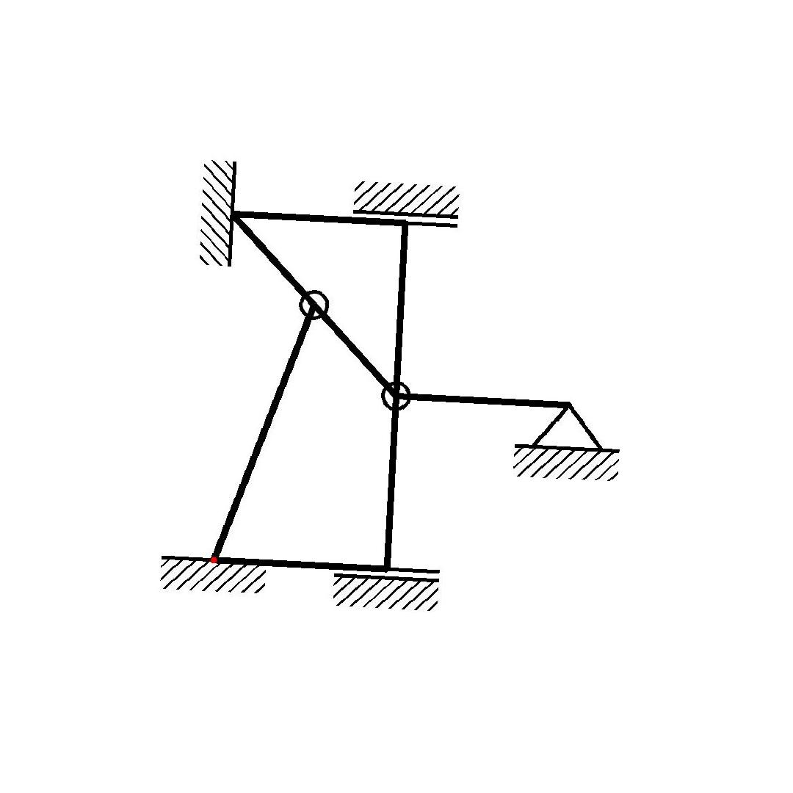
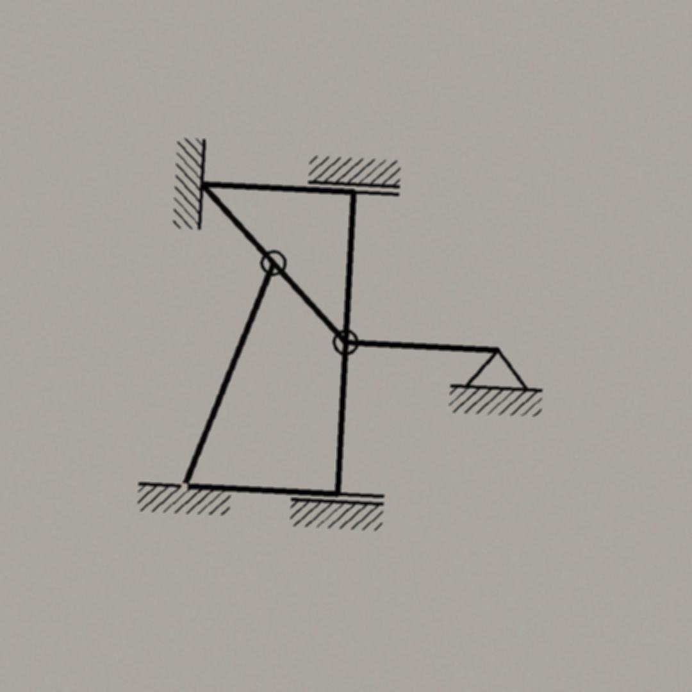
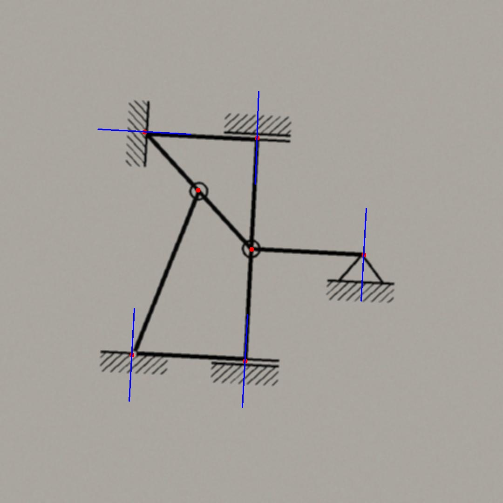
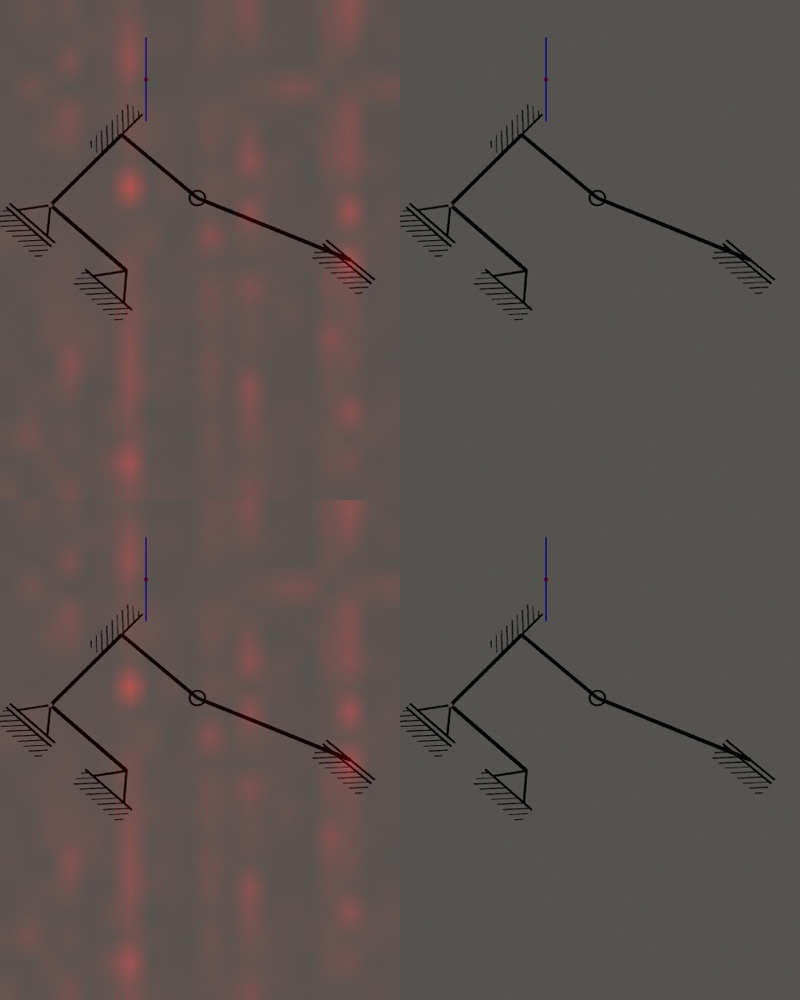
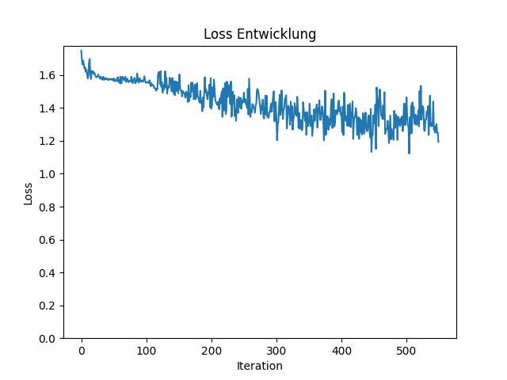
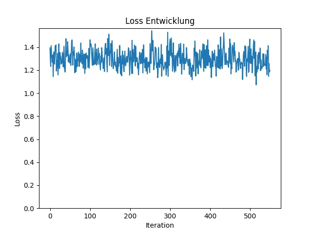

# TraStati

Generierung und erkennung statischer Systeme mittels Transformer

# Usage

### Generierung eines Datensets

```python
python main --data
```

### 3 stufige Generierung

<div>
    
     
    
</div>

1. Cut the Image - Als erstes wird das Image auf eine fest größe Zugeschnitten
2. Rotate the Image - Danach wird das Image random Rotiert
3. Noise the Image - Zum schluss wird das Image per Trapez Form randomized und die weißen Pixel werden zu einer Papier ähnlichen Farbe genoised

### Visualisierung eines Datasets

```python
python main --display
```


Label of the Image - Hier sieht man die ground Truths der Images

### Visualisierung des outputs eines Models

```python
python main --test
```

##### Output und Heatmaps

Loss von 1.19:



Die Predictions folgen keinem Muster, auch die Heatmap sieht sehr random aus.
Auch wieso jeder 2. Head keine Attention hat ist mir noch ein Rätsel.

### Trainieren eines Models

```python
python main --train
```

Der Verlauf der Lossentwicklung nach 5 Epochen mit 109 Batches mit jeweils 6 Images:



Der Loss des selben model nach weiteren 5 Epochen:



Wie man sieht springt der Loss sehr und Konvergiert auf keinen Fall gut.

Mögliche Verbesserungen:

- Verändern der Kostenfunktionen.
- Erhöhung der Anzahl an Heads, Encoder/ Decoder layer, sowie Erhöhung der hidden_dim.
(Braucht mehr Leistung, als gerade verfügbar)
- Anpassen der Hyperparameter.


# Installation

Alle pip dependencies können hiermit installiert werden.

```python
pip install -r requirements.txt
```

## Other dependencies

Da die Daten mit "pdflatex" mit python subprocess generiert werden, müssen "pdflatex", "convert" und "texlive-pictures" installiert sein.

#### Linux (Debian)

```console
sudo apt-get install texlive
sudo apt-get install imagemagick
sudo apt-get install texlive-pictures
```

#### Windows ("Theoretische Installation", da noch nicht ausprobiert)

Folge den Anweisungen auf
[TexLive](https://www.tug.org/texlive/windows.html)
um TexLive und TexLive-Pictures zu installieren.

Folge den Anweisungen auf
[ImageMagick](https://imagemagick.org/script/download.php#windows)
um ImageMick zu installieren.

## path configuration

Da mit custome LaTex librarys gearbeitet wird, muss der path zu dem data_folder configuriert werden.

#### Linux

Dies geht auf Linux mit:

```python
python start_up.py
```

### Windows

Bei Windows muss ausprobiert werden ob das auch funktioniert, oder welche Fehler ausgegeben werden.
Es muss aufjedenfall "data_folder/get_system_image" als Library Path für LaTex angegeben werden.

## Google Colab

Hier ist ein Google Collab link, dort kann man einfach den anwesiungen folgen und die Repository mal ausprobieren.

[TraStati Starthilfe](https://colab.research.google.com/drive/1uBNAzD4KOvp-wpPS1W5qIAhtLJrI14kr?usp=sharing)
