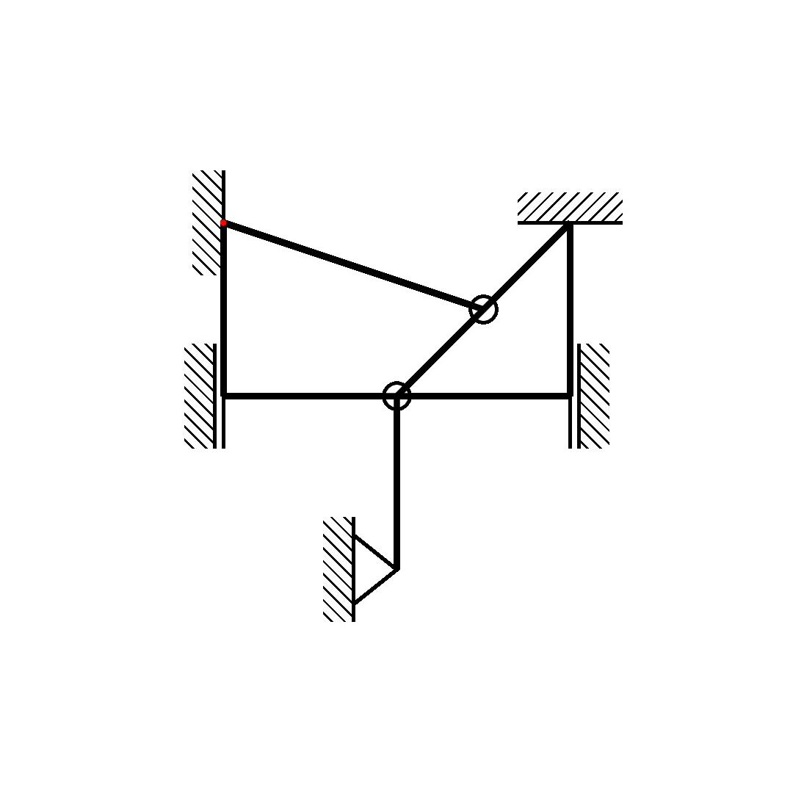

# TraStati

Generierung und erkennung statischer Systeme mittels Transformer

# Usage

### Generierung eines Datensets

```python
python main --data
```

### 3 stufige Generierung

<div>
    
     
    
</div>

1. Cut the Image - Als erstes wird das Image auf eine fest größe Zugeschnitten
2. Rotate the Image - Danach wird das Image random Rotiert
3. Noise the Image - Zum schluss wird das Image per Trapez Form randomized und die weißen Pixel werden zu einer Papier ähnlichen Farbe genoised

### Visualisierung eines Datasets

```python
python main --display
```


Label of the Image - Hier sieht man die ground Truths der Images

### Visualisierung des outputs eines Models

```python
python main --test
```

### Trainieren eines Models

```python
python main --train
```

# Installation

Alle pip dependencies können hiermit installiert werden.

```python
pip install -r requirements.txt
```

## Other dependencies

Da die Daten mit "pdflatex" mit python subprocess generiert werden, müssen "pdflatex", "convert" und "texlive-pictures" installiert sein.

#### Linux (Debian)

```console
$ sudo apt install texlive
$ sudo apt install imagemagick
$ sudo apt-get install texlive-pictures

```

## path configuration

Da mit custome LaTex librarys gearbeitet wird, muss der path zu dem data_folder coonfiguriert werden.

Dies geht mit:

```python
python start_up.py
```
